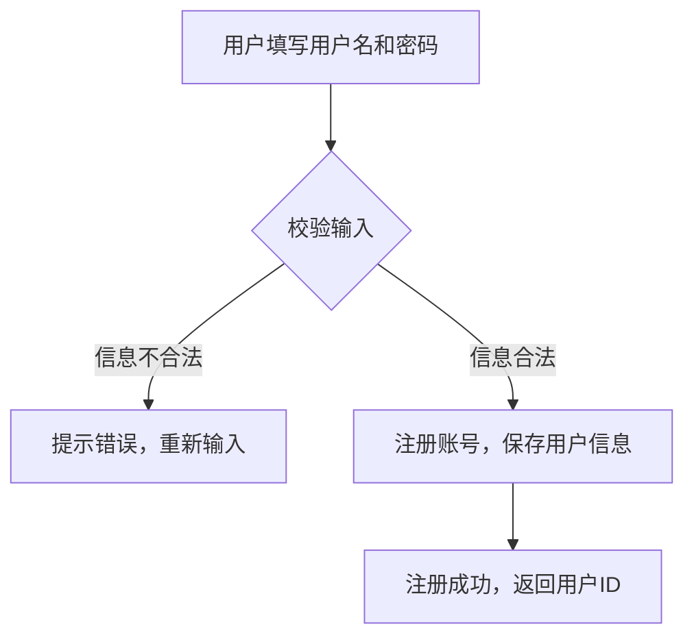

# 用户模块详细说明

## 1. 功能描述

用户模块负责用户的注册、登录、登出、信息管理等功能，确保用户身份的唯一性和安全性。

## 2. 主要用例

- **用户注册**：新用户通过用户名注册账号，设置密码，完成注册。

> 密码要求：长度6-32位，且必须包含大写字母、小写字母、数字、特殊字符中的至少三种类型。

- **用户登录**：已注册用户输入用户名和密码登录系统，支持记住登录状态。
- **用户登出**：用户主动退出登录，清除会话信息。
- **用户信息管理**：用户可修改昵称、头像、密码等个人信息。
- **忘记密码/重置密码**：用户通过用户名找回密码，重置新密码。

## 3. 数据结构

### 用户模型 User

| 字段         | 类型      | 说明           |
| ------------ | --------- | -------------- |
| id           | uint      | 用户ID         |
| username     | string    | 用户名，唯一   |
| password     | string    | 密码Hash（加密存储） |
| nickname     | string    | 昵称           |
| avatar       | string    | 头像           |
| role         | string    | 角色（user/admin，当前仅支持user） |
| created_at   | datetime  | 创建时间       |
| updated_at   | datetime  | 更新时间       |
| storage_limit| int64     | 存储空间上限   |
| storage_used | int64     | 已用空间       |

### 注册/登录请求结构

- RegisterRequest: { username, password }
- RegisterResponse: { id }
- LoginRequest: { username, password }
- LoginResponse: { token, user }

## 4. 接口说明

- `POST /api/user/register`  用户注册
  - 请求参数：用户名、密码
  - 返回：注册结果、用户ID
- `POST /api/user/login`  用户登录
  - 请求参数：用户名、密码
  - 返回：登录结果、Token、用户信息
- `GET /api/user/storage`  获取用户存储空间信息
  - 请求参数：Token（Authorization: Bearer <token>）
  - 返回：storage_used, storage_limit

> 其他接口如登出、信息修改、重置密码等可参考需求扩展。

## 5. Token 校验与权限控制

- 登录成功后，后端会生成 JWT Token，返回给前端。
- 前端后续请求需在 HTTP Header 中携带 `Authorization: Bearer <token>`。
- 后端接口会统一解析并校验 Token，有效后才能获取用户信息。
- Token 解析失败或过期，接口会返回 401 未授权。
- 普通用户仅能操作自己的资源。
- 文件/文件夹等资源操作接口均需校验 Token 并校验资源归属。

## 6. 密码加密与安全

- 密码注册时使用 bcrypt 算法加密存储，数据库中不保存明文密码。
- 登录时用 bcrypt 校验明文密码与 hash 是否匹配。
- 密码复杂度要求：长度6-32位，且必须包含大写字母、小写字母、数字、特殊字符中的至少三种类型。
- Token 机制防止伪造和重放攻击。
- 限制登录/注册频率，防止暴力破解。
- 敏感操作（如修改密码、用户名等）建议二次验证。

## 7. 异常处理

- 注册/登录失败（如账号已存在、密码错误、验证码错误等）
- 非法访问（如Token无效、权限不足等）
- 用户信息修改失败（如昵称重复、头像格式错误等）
- 密码重置失败（如验证码过期、账号不存在等）

## 8. 其他说明

- 注册时会自动为用户分配昵称（如"用户123456"）和初始化根目录。
- 用户空间配额默认1G，可根据业务调整。
- 所有接口均建议使用 HTTPS 保证数据安全。 