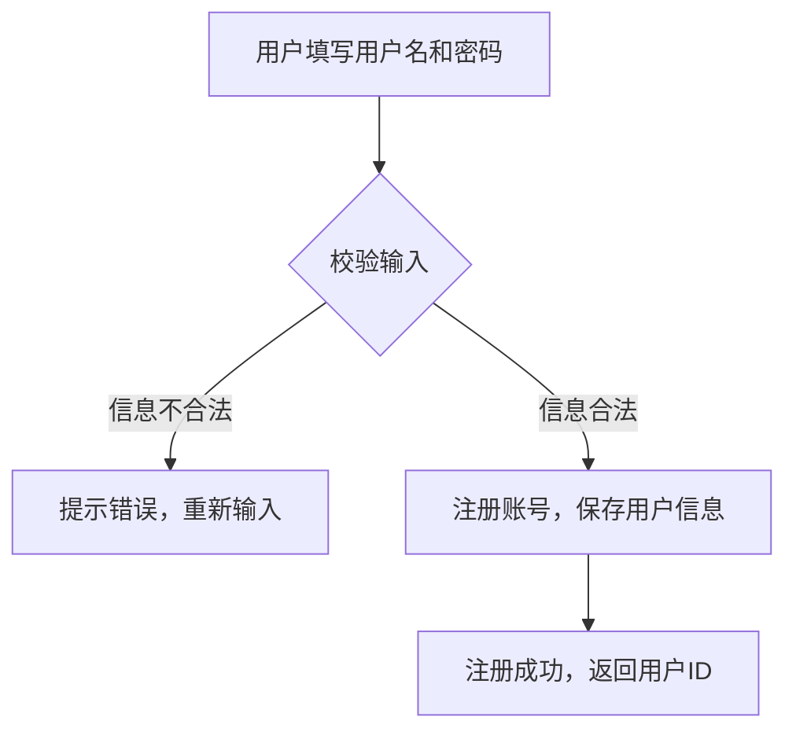

# 用户模块详细说明

## 1. 功能描述

用户模块负责用户的注册、登录、登出、信息管理、权限管理等功能，确保用户身份的唯一性和安全性。

## 2. 主要用例

- **用户注册**：新用户通过用户名注册账号，设置密码，完成注册。

> 密码要求：长度6-32位，且必须包含大写字母、小写字母、数字、特殊字符中的至少三种类型。

- **用户登录**：已注册用户输入用户名和密码登录系统，支持记住登录状态。
- **用户登出**：用户主动退出登录，清除会话信息。
- **用户信息管理**：用户可修改昵称、头像、密码等个人信息。
- **忘记密码/重置密码**：用户通过用户名找回密码，重置新密码。
- **权限管理**：区分普通用户和管理员，管理员可进行用户管理等操作。

## 3. 接口需求（示例）

- `POST /api/user/register`  用户注册
  - 请求参数：用户名、密码
  - 返回：注册结果、用户ID
- `POST /api/user/login`  用户登录
  - 请求参数：用户名、密码
  - 返回：登录结果、Token、用户信息
- `POST /api/user/logout`  用户登出
  - 请求参数：Token
  - 返回：登出结果
- `GET /api/user/profile`  获取用户信息
  - 请求参数：Token
  - 返回：用户详细信息
- `PUT /api/user/profile`  修改用户信息
  - 请求参数：Token、昵称、头像等
  - 返回：修改结果
- `POST /api/user/forgot-password`  忘记密码
  - 请求参数：用户名
  - 返回：验证码发送结果
- `POST /api/user/reset-password`  重置密码
  - 请求参数：用户名、验证码、新密码
  - 返回：重置结果

## 4. 权限说明

- 普通用户：仅能操作自己的文件和个人信息。
- 管理员：可管理所有用户、查看系统日志、分配权限等。
- 所有接口需进行身份认证（如JWT Token），部分接口需校验管理员权限。

## 5. 异常处理

- 注册/登录失败（如账号已存在、密码错误、验证码错误等）
- 非法访问（如Token无效、权限不足等）
- 用户信息修改失败（如昵称重复、头像格式错误等）
- 密码重置失败（如验证码过期、账号不存在等）

## 6. 安全要求

- 密码加密存储（如bcrypt）
- Token机制防止伪造和重放攻击
- 限制登录/注册频率，防止暴力破解
- 敏感操作需二次验证（如修改密码、用户名等） 